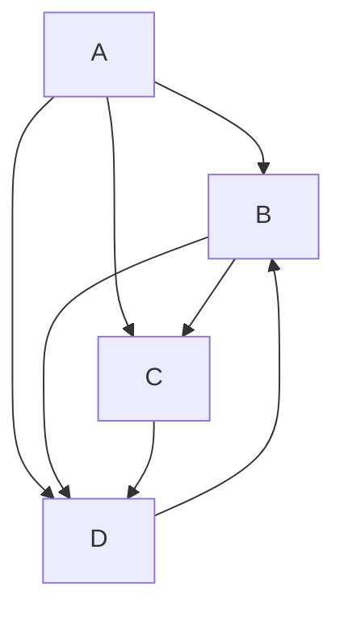
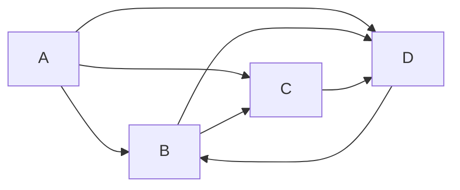

# Mermaid Diagrams

For more information visit the [Mermaid](https://mermaid.js.org/) webpage

**Markdown**

```` markdown

```mermaid
graph TD;
    A-->B;
    A-->C;
    A-->D;
    B-->C;
    B-->D;
    C-->D;
    D-->B;
```
````

**Output**


```mermaid
graph LR;
    A-->B;
    A-->C;
    A-->D;
    B-->C;
    B-->D;
    C-->D;
    D-->B;
```
