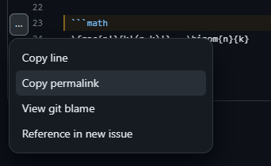
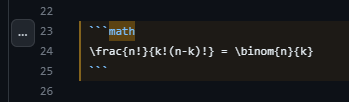
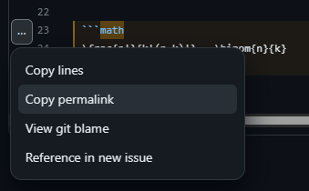

# Linking Code

**A Single Line**
1. Click on Line-Number  

2. Click an 'Copy permalink'  

3. Paste it to your Issue-Comment

---

**Multi-Line**
1. Click on start Line-Number  

1. Shift + Click on end Line-Number  

1. Click an 'Copy permalink'  

1. Paste it to your Issue-Comment

**Output**

look at https://github.com/Joerg-P-Wagner/Library/issues/5

---
