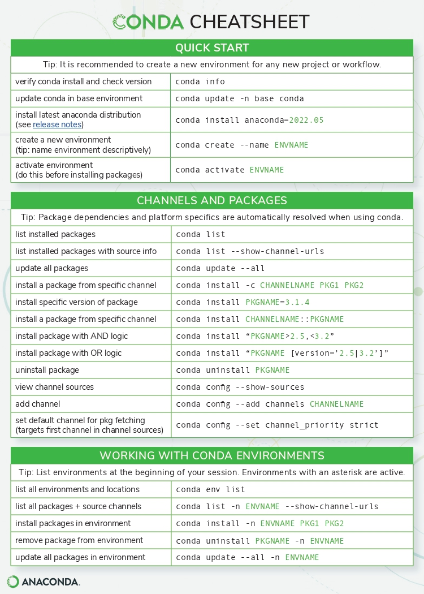
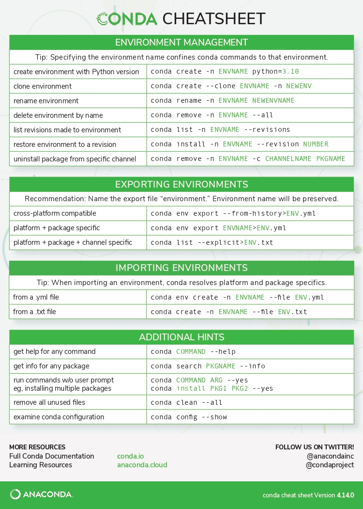

# conda workflow basics
[see for detailed information](https://docs.conda.io/projects/conda/en/latest/commands.html)
___
## basic workflow
|  | command | description |
| --- | --- | --- |
| - | conda --version | get the version of conda |
| - | conda list | lists all packages in the activated environment |

### Environments
|  | command | description |
| --- | --- | --- |
| - | conda env list | lists all environments |
| - | conda create --name \<env_name> | creates an environment with the name \<env_name> |
| - | conda create --name \<emv_name> python=\<versionnumber> | creates an environment with the name \<env_name> and the specific python-version |
| - | conda remove --name \<env_name> --all | delete an environment with the name \<env_name> |
| - | conda activate \<env_name> | activates the environment \<env_name> |
| - | conda deactivate \<env_name> | deactivates the environment \<env_name> |

### Packages
|  | command | description |
| --- | --- | --- |
| - | conda install \<pkg_name> | installs the package with the name \<pkg_name> at the activated environment |
| - | conda install -c conda-forge \<pkg_name> | installs the package with the name \<pkg_name> at the activated environment from [Conda-Forge](https://conda-forge.org/) |

### spyder
|  | command | description |
| --- | --- | --- |
| - | conda create --name \<env_name> | creates an environment with the name \<env_name> |
| - | conda activate \<env_name> | activates the environment \<env_name> |
| - | conda install spyder-kernels | installs spyder kernels in the environment |
| - | spyder | launch Spyder |
| - | in Spyder | Tools -> Preferences -> Python interpreter |
| - | select 'Use the following Python interpreter' | -> select \<env_name>\python.exe |

### Visual Studio Code
|  | command | description |
| --- | --- | --- |
| - | conda create --name \<env_name> | creates an environment with the name \<env_name> |
| - | conda activate \<env_name> | activates the environment \<env_name> |
| - |  | navigate to your project directory |
| - | code . | launch isua Studio Code |

### PyCharm
|  | command | description |
| --- | --- | --- |
| - | conda create --name \<env_name> | creates an environment with the name \<env_name> |
| - | conda activate \<env_name> | activates the environment \<env_name> |
| - | conda install ipykernel | installs the package 'ipykernel' |
| - |  | open Pycharm via Anaconda Navigator |
| - |  | in bottom-right corner -> select interpreter |
| - |  | choose Conda Environment -> existing Environment |
| - |  | select  \<env_name>

### JupyterLab
|  | command | description |
| --- | --- | --- |
| - | conda create --name \<env_name> | creates an environment with the name \<env_name> |
| - | conda activate \<env_name> | activates the environment \<env_name> |
| - | conda install ipykernel | installs python kernel in the environment |
| - | conda install jupyterlab | installs Jupyter Notebook in the environment |
| - | python -m ipykernel install --user --name=\<env_name> | match ipykernel to environment name |
| - | jupyter-lab | opens JupyterLab  |
| - | jupyter-lab --notebook-dir=\<path_to_folder> | opens JupyterLab in the specified path |

### Jupyter Notebook
|  | command | description |
| --- | --- | --- |
| - | conda create --name \<env_name> | creates an environment with the name \<env_name> |
| - | conda activate \<env_name> | activates the environment \<env_name> |
| - | conda install ipykernel | installs python kernel in the environment |
| - | conda install notebook | installs Jupyter Notebook in the environment |
| - | python -m ipykernel install --user --name=\<env_name> | match ipykernel to environment name |
| - | jupyter notebook | opens Jupyter Notebook  |
| - | jupyter notebook --notebook-dir=\<path_to_folder> | opens Jupyter Notebook in the specified path |
| - | in Jupyter Notebook | select in upper right corner (new dropdown) <env_name> |

---

